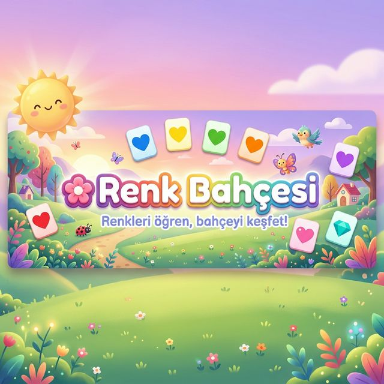
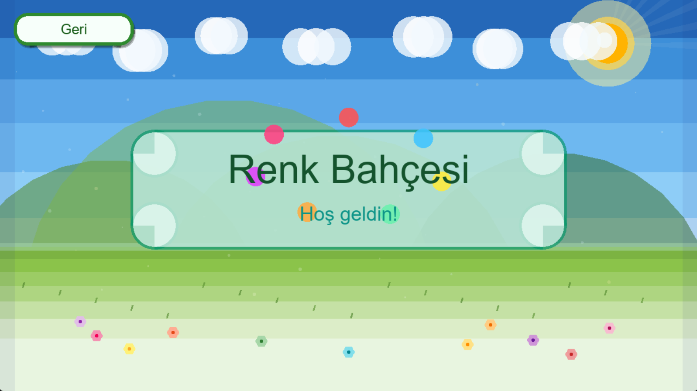
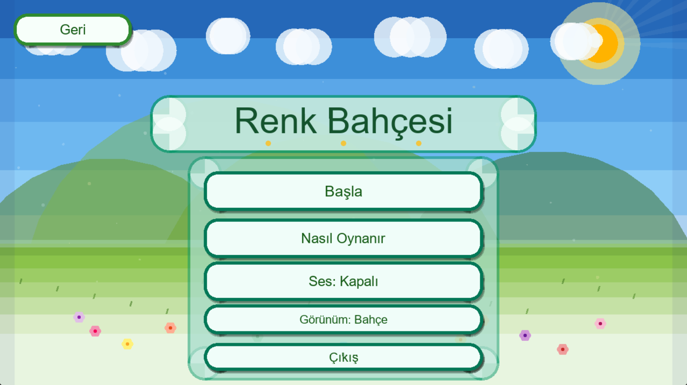
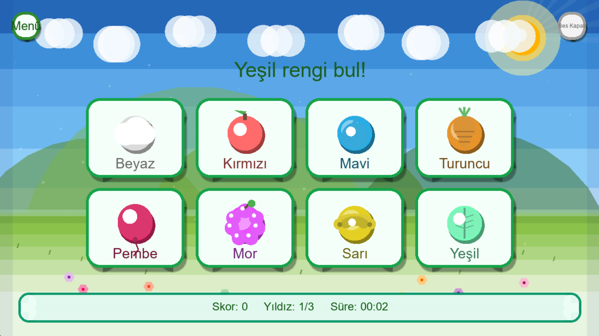
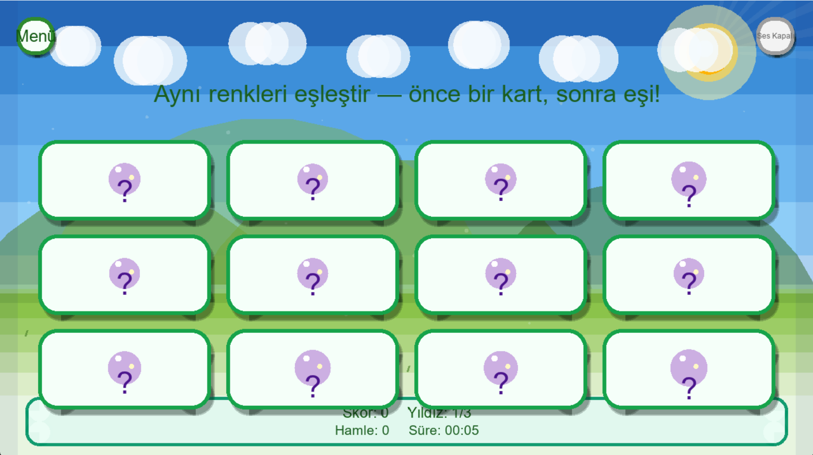
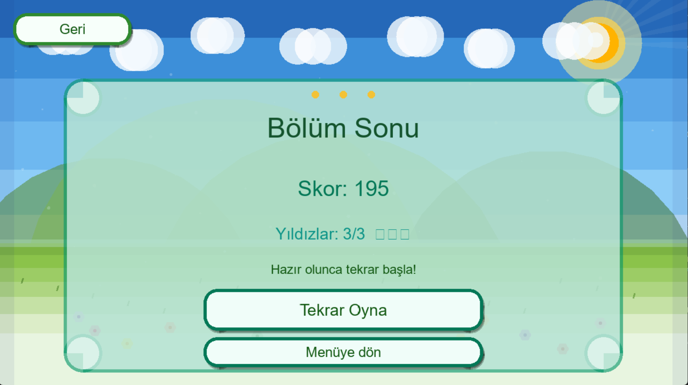
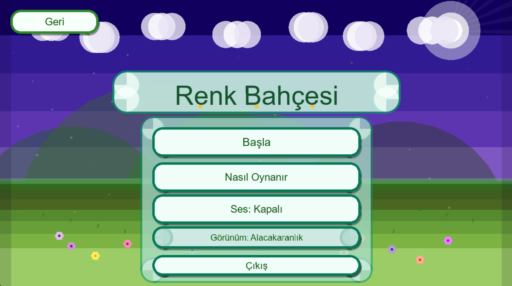

<div align="center">



# 🌸 Renk Bahçesi

**Okul öncesi ve erken ilkokul çocukları için Türkçe renk oyunu**

[](https://www.ruby-lang.org)
[](https://www.ruby2d.com)
[](.)
[](LICENSE)

> *"Hangi rengi arıyoruz?" — Cevap kartların arasında, bahçenin içinde.*

</div>

---

## 📸 Ekran Görüntüleri

<table>
  <tr>
    <td align="center"><br/><sub><b>Açılış Ekranı</b></sub></td>
    <td align="center"><br/><sub><b>Ana Menü — Bahçe Teması</b></sub></td>
  </tr>
  <tr>
    <td align="center"><br/><sub><b>Rengi Bul — Oyun İçi</b></sub></td>
    <td align="center"><br/><sub><b>Eşini Bul — Hafıza Oyunu</b></sub></td>
  </tr>
  <tr>
    <td align="center"><br/><sub><b>Bölüm Sonu — Yıldız Kazanıldı!</b></sub></td>
    <td align="center"><br/><sub><b>Alacakaranlık Teması</b></sub></td>
  </tr>
</table>

---

## 🌟 Ne bu oyun?

**Renk Bahçesi**, renkleri ezberletmek yerine *tanıma, ayırt etme* ve *küçük zafer hissini* pekiştirmek için tasarlanmış bir eğitim oyunudur. Ebeveyn veya öğretmen eşliğinde kısa oturumlara uygundur; sert ceza yok, sadece **keşfet, eşleştir, gülümse**.

### Neden farklı?

- **Tamamen Türkçe** — arayüz, görev metinleri, her şey
- **Çocuk dostu tasarım** — büyük butonlar, yumuşak renkler, sezgisel akış
- **Animasyonlu arka plan** — canlı gökyüzü, yüzen bulutlar, sallanan çimenler
- **Prosedürel ikon sistemi** — her rengin kendine özel kodu çizilen sembolü var (Elma, Damla, Muz, Yaprak… Ruby2D primitifleriyle, sıfır harici görsel)
- **Sıfır çökme garantisi** — eksik ses/görsel dosyasında oyun sorunsuz devam eder

---

## 🎮 Oyun Modları

| Mod | Nasıl Oynanır? | Geliştirir |
|:---|:---|:---|
| 🔍 **Rengi Bul** | Söylenen rengi kartlar arasından seç | Renk tanıma, hız, dikkat |
| 🃏 **Eşini Bul** | Aynı rengi taşıyan kartları sırayla aç | Hafıza, odak, eşleştirme |
| 🎵 **Ton Yakala** | *(Yakında — altyapı hazır)* | Renk tonu farkındalığı |

### Zorluk Seviyeleri

| Seviye | Kart Sayısı | Ek Özellik |
|:---|:---|:---|
| 🟢 **Kolay** | 4 kart | Geniş zaman, tanıdık renkler |
| 🟡 **Orta** | 6 kart | Daha hızlı bonus eşiği |
| 🔴 **Zor** | 8 kart | Süre baskısı, seri bonusu |

---

## ✨ Özellikler

```
🎨  10 aktif renk — her biri kodla çizilen özgün ikon (Circle/Triangle/Line, harici görsel yok)
🌍  3 görsel tema: Bahçe (gündüz) · Alacakaranlık · Yüksek Kontrast
⭐  Çocuk dostu yıldız sistemi (1–3 yıldız, asla 0)
🔊  Ses açma/kapama — oyun içinden değiştirilebilir
💾  Yerel kayıt (save_data.json) — skor, tema, ses tercihi saklanır
🏆  Seri bonusu — arka arkaya doğru cevap = ekstra puan
⏱️  Süre sayacı ve anlık yıldız tahmini (oyun içinde HUD)
🌸  Canlı arka plan animasyonları: bulut, güneş, çimen hareketi
🎆  Doğru cevapta parlaklık efekti, yanlışta sarsma animasyonu
```

---

## 🚀 Kurulum

### Gereksinimler

- Ruby 3.x
- Ruby2D gem (SDL2 tabanlı)

### Windows

```powershell
# 1. Ruby+Devkit kur (https://rubyinstaller.org/)
# 2. DevKit araç zincirini etkinleştir
ridk install   # MSYS2 toolchain seçin, terminali yeniden açın

# 3. Projeye git ve bağımlılıkları kur
cd renkbahçesi
bundle install

# 4. Çalıştır
ruby main.rb
```

> **Not (Windows):** Klasör adında Türkçe karakter (ç, ğ, ş…) varsa terminali **doğrudan proje kökünde** açın. `cd` ile girmek bazen `__dir__` yol çözümünü etkiler; `main.rb` her iki durumu da halleder.

### Linux

```bash
# Ubuntu / Debian — SDL2 paketleri
sudo apt-get install libsdl2-dev libsdl2-image-dev libsdl2-mixer-dev libsdl2-ttf-dev

bundle install
ruby main.rb
```

---

## 🧪 Testler

```bash
bundle exec rake test
```

CI (GitHub Actions) her push'ta sözdizimi kontrolü + birim testleri çalıştırır.

---

## 🏗️ Proje Yapısı

```
renkbahçesi/
├── main.rb                     # Giriş noktası (Windows yol çözümü dahil)
├── Gemfile                     # Bağımlılıklar
├── Rakefile                    # Test runner
├── save_data.json              # İlk çalıştırmada otomatik oluşur
│
├── src/
│   ├── game.rb                 # Ana Game sınıfı, sahne kaydı
│   ├── config/
│   │   ├── game_config.rb      # Sabitler (boyut, hız, zamanlama…)
│   │   ├── colors.rb           # 10 renk tanımı (hex + ikon + ses)
│   │   ├── texts.rb            # Tüm UI metinleri (Türkçe)
│   │   ├── ui_theme.rb         # Buton / panel renk tokenleri
│   │   └── visual_theme.rb     # 3 görünüm teması (Bahçe, Gece, Kontrast)
│   │
│   ├── core/
│   │   ├── state_machine.rb    # Sahne yöneticisi (push/pop stack)
│   │   ├── asset_loader.rb     # Ses/görsel yükleme (graceful fallback)
│   │   ├── audio_manager.rb    # Müzik + efekt yönetimi
│   │   ├── animation_helper.rb # Tween, glow, shake, opacity
│   │   ├── input_handler.rb    # Tıklama spam koruması
│   │   └── timer.rb            # ms hassasiyetli zamanlayıcı
│   │
│   ├── models/
│   │   ├── color_card.rb       # Renk kartı veri modeli
│   │   ├── level.rb            # Seviye verisi
│   │   └── player_progress.rb  # Kayıt modeli
│   │
│   ├── services/
│   │   ├── level_generator.rb  # Seviye içerik üretici
│   │   ├── scoring_service.rb  # Puan + yıldız hesabı
│   │   ├── save_service.rb     # JSON okuma/yazma
│   │   └── game_session_service.rb
│   │
│   ├── scenes/
│   │   ├── base_scene.rb       # Ortak arka plan + buton altyapısı
│   │   ├── splash_scene.rb     # Açılış animasyonu
│   │   ├── menu_scene.rb       # Ana menü
│   │   ├── help_scene.rb       # Nasıl oynanır
│   │   ├── mode_select_scene.rb
│   │   ├── difficulty_select_scene.rb
│   │   ├── game_scene_find_color.rb
│   │   ├── game_scene_match_pairs.rb
│   │   └── result_scene.rb     # Bölüm sonu
│   │
│   └── ui/
│       ├── button.rb           # Hover + press animasyonlu buton
│       ├── card_view.rb        # Prosedürel ikon + flip + glow
│       ├── panel.rb            # Yuvarlak köşeli panel (CSS-free)
│       └── label.rb
│
├── assets/
│   ├── sounds/                 # Ses dosyaları (opsiyonel)
│   ├── fonts/                  # Yazı tipi (opsiyonel)
│   └── screenshots/            # README görselleri
│
└── test/                       # Minitest birim testleri
```

---

## 🎯 Oyun Akışı

```
Açılış  ──▶  Ana Menü  ──▶  Mod Seç  ──▶  Zorluk Seç
                │                               │
                │◀──── Menü / Geri ─────────────│
                                               ▼
                                         Oyun (Bölümler)
                                               │
                                         Bölüm Sonu ──▶ Tekrar / Menü
```

---

## 🗺️ Yol Haritası

- [ ] **Ton Yakala** modunun oynanabilir sürümü
- [ ] Daha fazla renk (Gri, Lacivert, Açık Mavi…)
- [ ] Ebeveyn paneli (oturum istatistikleri)
- [ ] Ses kümesi (her renk için özel efekt)
- [ ] İngilizce / ek dil desteği

---

## 🤝 Katkı

1. Repo'yu fork'la
2. Feature branch aç: `git checkout -b ozellik/yeni-mod`
3. Değişikliklerini commit'le
4. Pull request aç — her türlü katkı memnuniyetle karşılanır!

Hata bildirimi için **Issues** sekmesini kullanabilirsiniz.

---

## 📄 Lisans

MIT License — ayrıntılar için `LICENSE` dosyasına bakın.

---

<div align="center">

**Renk Bahçesi** — küçük adımlarla büyük gülümsemeler. 🌸

*Ruby2D ile sevgiyle yapıldı.*

</div>
